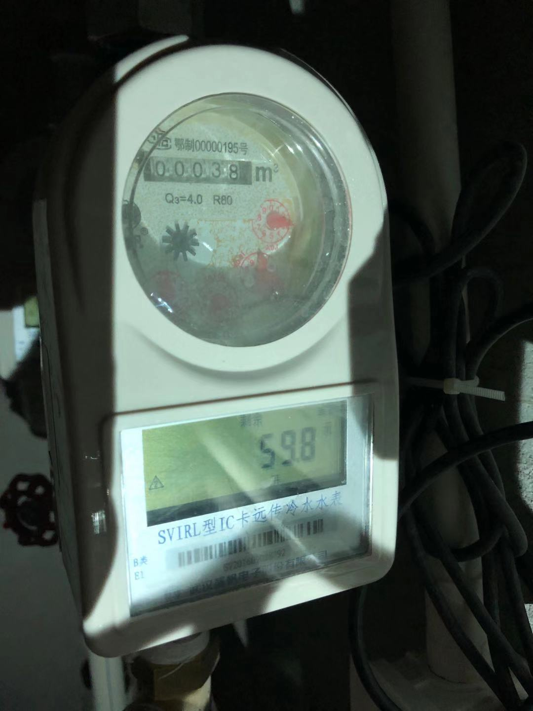

# prj001-doc001
## 添加补卡，调休，请假
 - 目前门店工作人员用企业微信打卡机打卡
 - 办公室及管理层人员使用钉钉打卡
 
 
 ## 财务建议优化
 - 采购由申请人自己提出申请，
   - 现行仍由采购直接申请
   - 审批流程之后程总直接打款，没有提交原始单据到财务处挂账
     - 欠半年以上
   - 直接采购回商品，未做入库，也未将原始单据提交财务做冲账处理
   - 库存没有人管理，没有出入库单据凭证（流程问题）
   - 资金管理：资金往来的用途没有明确标示，流水需要标注清楚
   - 报销人员整理好报销凭证按时报销
   
 ## 运营
  - 除了通过后台数据分析看门店情况，有没有场景或者时时反馈信息出来
  - 产品及时拍照更新上共享群
   
  ## 管理
  - 各门店及公司，有物业对接人员负责事宜（租金、水、电费），跟进状况
  
   - 管理处
     - 电费缴费户号 6834637102 户名 桂祥
      
     - 11.26 办公室今天停水，已充值100元，余额124.00元(水费消费约:45.00元/月).
      
  - 世纪中心门店
     - 11.25  停电状况
    
     
  
    
