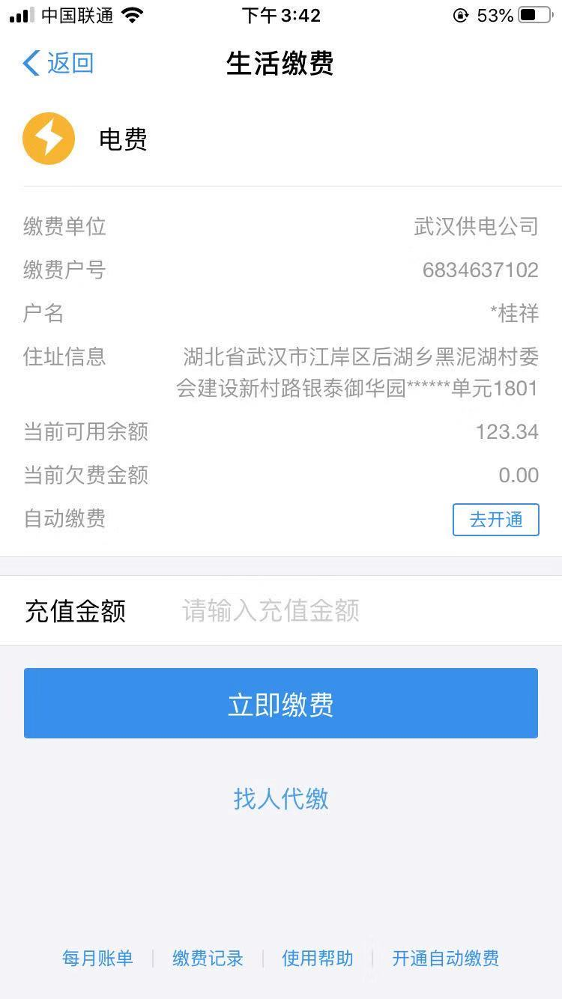
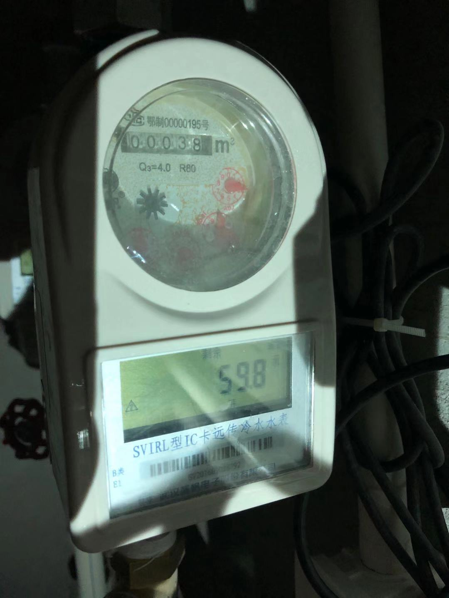

# prj001-doc001
## 添加补卡，调休，请假
 - 目前门店工作人员用企业微信打卡机打卡
 - 办公室及管理层人员使用钉钉打卡
 
 
 ## 财务建议优化
 - 采购和报销是两条不同支线的流程。
   - 采购由申请人自己提出申请，部门领导审核后流转到项目负责人审核，再流转到财务审核，最后流转到公司领导审核
     - 现行仍由采购直接申请
     - 审批流程之后程总直接打款，并且采购后没有提交原始单据到财务处挂账
       - 欠半年以上
   - 直接采购回商品后，未做入库登记，也未将原始单据及时提交到财务做记账处理
   - 仓库库存没有人管理，没有出入库单据凭证（流程问题）
   - 资金管理：资金往来的用途没有明确标示，流水需要标注清楚该资金去向及用途，每一笔款项都必须要有单据作为附件进行该笔经济业务的解释说明
  - 报销流程：
    - 报销人将单据整理好并按规定填写报销单
    - 将报销单连同粘贴的附件一起拿给部门经理及项目负责人签字（确认该笔经济业务确实发生，内容与填写单据及附件一致）
    - 提交到会计进行审核确认金额及发票票据是否合法
    - 再将报销单交给公司领导签字（同意报销该笔款项并及时打款）
    - 最后将该报销单交给出纳
    - 由出纳及时转账付款。
   
 ## 运营
  - 除了通过后台数据分析看门店情况，有没有场景或者时时反馈信息出来
  - 产品及时拍照更新上共享群
   
  ## 管理
  - 各门店及公司，有物业对接人员负责事宜（租金、水、电费），跟进状况
  
   - 管理处
     - 电费缴费户号：6834637102 户名：桂祥，已充值100元，11.26日余额124.00元
      
     - 11.26 办公室停水，(水费月消费约:45.00元/月)，11.26日余额59.8元
      
      
   - 世纪中心门店
      - 11.25  停电状况
  
   - 御华里门店
     
   - 众圆广场门店
       
